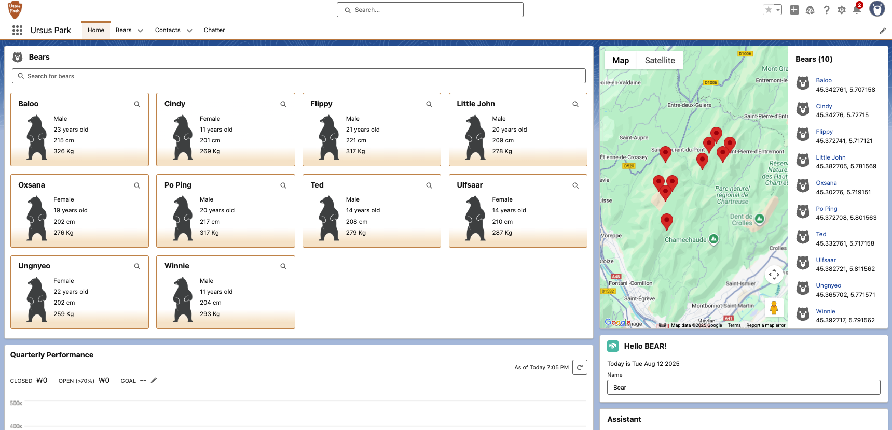

# 🐻 Bear Tracking App (Salesforce LWC)

## 📌 개요

Bear Tracking App은 Salesforce Lightning Web Components(LWC)로 개발된 곰 데이터 관리 및 위치 시각화 애플리케이션입니다.  
곰 데이터를 검색하고, 지도에서 위치를 확인하며, 상세 페이지로 이동할 수 있는 기능을 제공합니다.

---

## 🎯 프로젝트 목표

- Bear 데이터 검색, 목록, 지도 시각화를 하나의 앱에서 제공
- Lightning Message Service를 활용한 컴포넌트 간 실시간 데이터 연동
- Salesforce 표준 컴포넌트를 적극 활용하여 UI·UX 향상

---

## 🛠 활용 기술

- **Frontend**: Lightning Web Components (LWC)
- **Messaging**: Lightning Message Service (LMS)
- **Navigation**: Lightning Navigation Service
- **Data API**: Lightning UI Record API
- **Visualization**: Lightning Map
- **Static Resources**: ursus_park (곰 이미지)

---

## 📂 주요 컴포넌트

- `bearList`: 곰 데이터 검색 및 목록 표시
- `bearMap`: 곰 위치 지도 표시 (LMS로 데이터 수신)
- `bearTile`: 개별 곰 카드 UI
- `bearLocation`: 개별 곰 위치 상세 지도
- `bearSupervisor`: 곰 담당자 정보 표시

---

## 🚀 실행 흐름

1. 사용자가 검색창에서 곰 이름을 입력
2. `bearList`에서 Apex 메서드 호출 후 결과 표시
3. 검색 결과를 Lightning Message Service로 `bearMap`에 전달
4. 지도에서 곰 위치를 표시
5. `bearTile` 클릭 시 곰 상세 페이지로 이동

---

## 📈 성과 및 배운 점

- LWC ↔ Apex 데이터 연동, LMS 기반 컴포넌트 간 실시간 데이터 전송 경험
- Salesforce 표준 컴포넌트 활용 및 UI·UX 개선 역량 강화
- 지도 기반 시각화 및 네비게이션 기능 실습

---

## 📸 Screenshot

## 🎥 Demo Video

---

## 📜 License

Ursus Park sample app for Trailhead project Build Flexible Apps with Lightning Web Components
